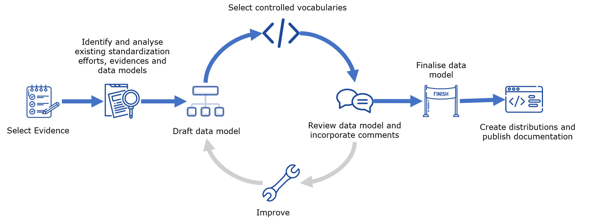

# Disclaimer

**The methodology is currently under review as part of the SDG OOP first review cycle until the 12th of November 2020**

Both content and form of the methodology have been developed for a web-based publication in the ASCII doc format on the SDG Sandbox, to facilitate its usage and maintenance over time. In the context of the OOP first review cycle, the methodology has been transposed in a [Word-format document](https://ec.europa.eu/cefdigital/wiki/x/XgHGDw). While reviewing, please focus on the following questions: 

* Do the phases make sense (e.g. gaps, overlaps)? 
* Do the steps make sense? 
* Is the ownership of a specific step justified? 
* Are the activities of a step complete and granular enough? 
* Are the activities of a step well described? 
* Can I provide additional rules, guidelines and tools? 
* What example could best illustrate a specific step?

Following the review and the feedback from the reviewers, the methodology will be updated on the SDG sandbox. 

Throughout the different steps, the methodology is illustrated with different examples. Please bare in mind that additional examples will be captured during a dedicated workshop on the 4th of November.

As described in the [review guidelines on the SDG wiki](https://ec.europa.eu/cefdigital/wiki/display/SDGOO/First+review+cycle+-+WP4), this very document should be uploaded on the [SDG wiki](https://ec.europa.eu/cefdigital/wiki/display/SDGOO/First+review+cycle+-+WP4) with comments, as a single version, on the same link, respecting the following rules: 

1.	Please add your comments to this document only and do not split them.
2.	Please add comments only and avoid using track changes. 
3.	All track changes will be disregarded. Once you have completed the review, please append your alpha-2 country code to the document’s title, for example: BE_(document title)
4.	Please upload the document to the respective row in the table on the SDG wiki (see table 'to upload').

As indicated, reviewers have until the 6th of November to perform their review and share their comments if any. 

# Methodology

This folder contains the various steps that together make up the methodology used to develop the data models of the evidences.

## Process

**Key phases of the process**\

**Access each phase**
- [`Phase 1`: Select evidence](phase1.md)
- [`Phase 2`: Analyse existing evidence and models](phase2.md)
- [`Phase 3`: Draft data model](phase3.md)
- [`Phase 4`: Review data model and incorporate comments](phase4.md)
- [`Phase 5`: Select controlled vocabularies](phase5.md)
- [`Phase 6`: Finalise data model](phase6.md)
- [`Phase 7`: Create distributions and publish documentation](phase7.md)

**Detailed process**\

