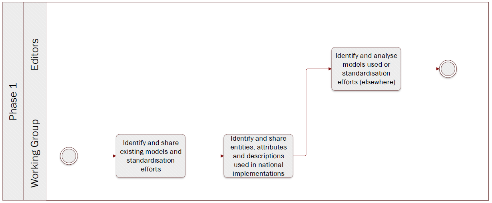

# Phase 1: Select evidence


**Quick links:**
- [`Step 1` Select the evidences]()
- [`Step 1.1` Select procedures]()
- [`Step 1.2` List of relevant evidences]()
- [`Step 1.3` Evidences likely to be exchanged]()
- [`Step 2` Identify the competent authorities]()

**Navigate to the different phases**\
[:arrow_left: Overview](https://github.com/cbahim/SDG-sandbox/tree/master/process_and_method/methodology) **|**
[Next phase :arrow_right:](phase2.md)

## `Step 1` Select the evidences  

**Key activities**
> 

<details>
  <summary><b>Description</b></summary>
</details>

<details>
  <summary><b>Rules and Guidelines</b></summary>
</details>

<details>
  <summary><b>Tool(s)</b></summary>
  <i>There are no specific tools for this step.</i>
</details>

<details>
  <summary><b>Example(s)</b></summary>

```
  TBD
  ```
</details>

## `Step 1.1` Select procedures 

**Key activities**
> 

<details>
  <summary><b>Description</b></summary>
</details>

<details>
  <summary><b>Rules and Guidelines</b></summary>
</details>

<details>
  <summary><b>Tool(s)</b></summary>
  <i>There are no specific tools for this step.</i>
</details>

<details>
  <summary><b>Example(s)</b></summary>

```
  TBD
  ```
</details>

## `Step 1.2` List of relevant evidences 

**Key activities**
> 

<details>
  <summary><b>Description</b></summary>
</details>

<details>
  <summary><b>Rules and Guidelines</b></summary>
</details>

<details>
  <summary><b>Tool(s)</b></summary>
  <i>There are no specific tools for this step.</i>
</details>

<details>
  <summary><b>Example(s)</b></summary>

```
  TBD
  ```
</details>

## `Step 1.3` Evidences likely to be exchanged

**Key activities**
> 

<details>
  <summary><b>Description</b></summary>
</details>

<details>
  <summary><b>Rules and Guidelines</b></summary>
</details>

<details>
  <summary><b>Tool(s)</b></summary>
  <i>There are no specific tools for this step.</i>
</details>

<details>
  <summary><b>Example(s)</b></summary>

```
  TBD
  ```
</details>

## `Step 2` Identify the competent authorities 

**Key activities**
> 

<details>
  <summary><b>Description</b></summary>
</details>

<details>
  <summary><b>Rules and Guidelines</b></summary>
</details>

<details>
  <summary><b>Tool(s)</b></summary>
  <i>There are no specific tools for this step.</i>
</details>

<details>
  <summary><b>Example(s)</b></summary>

```
  TBD
  ```
</details>