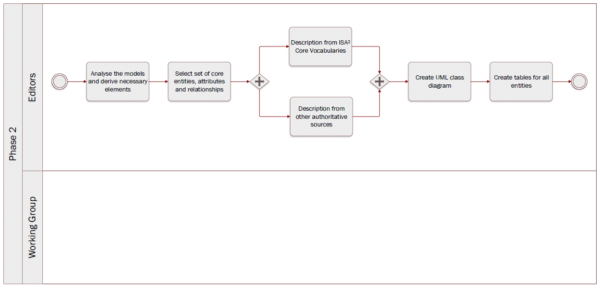

# Phase 2: Draft data model

**Quick links:**
- [`Step 4` Analyse the models and derive necessary elements](#step-4-Analyse-the-models-and-derive-necessary-elements)
- [`Step 5` Select set of core entities, attributes and relationships](#step-5-Select-set-of-core-entities,-attributes-and-relationships)
- [`Step 6` Description from ISA² Core Vocabularies](#step-6-Description-from-ISA²-Core-Vocabularies)
- [`Step 7` Description from other authoritative sources](#step-7-Description-from-other-authoritative-sources)
- [`Step 8` Create UML class diagram](#step-8-Create-UML-class-diagram)
- [`Step 9` Create tables for all entities](#step-9-Create-tables-for-all-entities)

**Navigate to the different phases**\
[:arrow_left: Previous phase](phase1.md) **|**
[Next phase :arrow_right:](phase3.md)

## `Step 4` Analyse the models and derive necessary elements
<i><b>Technical analysis</b> - identification of technical requirements and related solutions.</i>

**Key activities**
> * The [<b>Editors</b>](../stakeholders#editors) analyse the existing data models and information shared to check what is common and can be reused.

  
<b>Description</b>

  
The Editors analyse the data models, concrete examples and other useful documentation received from the Working Group and the DGs in the previous steps. Specifically, they look for similarities (and dissimilarities) between the different data models and documentation in order to identify a common set of entities, attributes and relationships that are relevant for the respective evidence that is being modelled.

Considering the procedure, and thus the use case(s), for which the evidence is being modelled will also inform the analysis of models and documentation in order to derive necessary elements. 

  
<b>Rules and Guidelines</b>

  
* The OOTS data model for specific evidence types will not be used to model paper documents but rather evidence itself, i.e., information required by competent authorities to prove a fact about a citizen or business. Therefore, when modelling evidence types, the granularity of the data should be limited to the fact the citizen or business needs to provide to complete a procedure. The Editors should look for the minimum common denominator when consolidating and analysing (fragments of) data models and information received. 
* The [SKOS Mapping Properties](https://www.w3.org/TR/skos-reference/#mapping) can be used to compare entities or attributes across different models.
* When selecting the core entities, attributes and relationships, the editors can define thresholds making it possible to decide which of the latter will be mandatory, optional or discarded. For instance, if no other Member State mentioned the need for an attribute it should be discarded.

  
<b>Tool(s)</b>

* [Linked Open Vocabularies](https://lov.linkeddata.es/dataset/lov) which is a source for predicates, i.e. existing attributes/relationships that might be candidates for reuse.
* A spreadsheet can be used to present and compare the different data models.

  
<b>Example(s)</b>

  
The table below illustrates how SKOS mapping properties can be used to compare models. 
<b> insert picture </b>
If provided, the table can also include definitions and URIs to ease comparison.

## `Step 5` Select set of core entities, attributes and relationships
<i><b>Technical analysis</b> - identification of technical requirements and related solutions.</i>

**Key activities**
> * The [<b>Editors</b>](../stakeholders#editors) select the entities, attributes and relationships that are needed to model the respective evidence.
> * The [<b>Editors</b>](../stakeholders#editors) propose which attributes and relationships are mandatory / optional. 

  
<b>Description</b>

  
With the output of the previous steps, the Editors select the entities, attributes and relationships that are common to most data models and that are necessary to model the evidence. They also determine which attributes should be mandatory and which should be optional. 

They do this by agreeing on thresholds with the Working Group. These thresholds might be quantifiable, e.g. “if at least five Member States have an attribute, the attribute is included” or “if one Member State is not able to provide an attribute, the attribute is made optional”.
  

  
<b>Rules and Guidelines</b>

  
Be as specific as possible, without restricting local flexibility too much.

  
<b>Tool(s)</b>

  
* A spreadsheet  can be used to select the set of core entities, attributes and relationships of the OOTS data model for specific evidence types.
* The collaborative tool can be used to discuss on the inclusion of entities, attributes and relationships.

## `Step 6` Description from ISA² Core Vocabularies
<i><b>Technical analysis</b> - identification of technical requirements and related solutions.</i>

**Key activities**
> The [<b>Editors</b>](../stakeholders#editors) assess whether the ISA² Core Vocabularies can be reused

  
<b>Description</b>

  
The Editors verify whether an ISA² Core Vocabulary can be reused. Reuse is a key objective when drafting OOTS data model for specific evidence types. In case there is no reusable ISA² Core Vocabulary, or it is not coherent with the context of the OOTS data model for specific evidence types, the editors will consider other possibilities as presented in step 7.

> Core Vocabularies are simplified, re-usable and extensible data models that capture the fundamental characteristics of an entity in a context-neutral fashion. Public administrations can use and extend the Core Vocabularies in the following contexts:
> * Development of new systems
> * Information exchange between systems
> * Data integration
> * Open data publishing 

  
<b>Tool(s)</b>

  
  
* [Core Person Vocabulary](https://joinup.ec.europa.eu/release/core-person-vocabulary/100)
* [Core Business Vocabulary](https://joinup.ec.europa.eu/release/core-business-vocabulary/100) 
* [Core Location Vocabulary](https://joinup.ec.europa.eu/release/core-location-vocabulary/100) 
* [Core Criterion and Core Evidence Vocabulary](https://joinup.ec.europa.eu/release/core-criterion-and-core-evidence-vocabulary-v100)
* [Core Public Organisation Vocabulary](https://joinup.ec.europa.eu/release/core-public-organisation-vocabulary-v100) 
* [Core Public Service Vocabulary Application Profile](https://joinup.ec.europa.eu/collection/semantic-interoperability-community-semic/solution/core-public-service-vocabulary-application-profile)

  
<b>Example(s)</b>

* The Core Person Vocabulary describes a class/entity Person that has an attribute/property "gender" that expects a Code as data type, coming from four possible controlled vocs: ISO, Eurostat, HL7 or SDMX.
* Gender is a challenging topic due to the varying recognition of non-binary gender, [issue #143](https://github.com/SEMICeu/SDG-sandbox/issues/143).

## `Step 7` Description from other respected sources
<i><b>Technical analysis</b> - identification of technical requirements and related solutions.</i>

**Key activities**
> The [<b>Editors</b>](../stakeholders#editors) gather information elsewhere than the ISA² Core Vocabularies.

  
<b>Description</b>

  
 Should an entity or attribute not be (properly) defined in the ISA² Core Vocabularies, the editors will find adequate documentation elsewhere.
<i>‘Not properly defined’ refers to a circular definition of a term, i.e. already containing the term that is to be defined.</i> 

1. Other respected sources can be considered when the terms are defined in a well-known domain-specific ontology.  
In general, entities, attributes, relationships and definitions should be linked to existing terminologies. 
2. In the event of information not being available in existing vocabularies, the editors propose definitions for new entities / attributes using respected and authoritative dictionaries (which are deemed to be of excellent quality).

<i>A ‘respected dictionary’ refers to a dictionary widely regarded as an authority on the English language. </i>

  
<b>Rules and Guidelines</b>

  
Generic rules and guidelines 
* Entities can be documented by using tools such as the [Interoperability Platform and Data Vocabularies Tools](https://ec.europa.eu/isa2/actions/improving-semantic-interoperability-european-egovernment-systems_en).

Specific rules and guidelines for  the table per entity
* When defining a term, it should not be included in the tentative definition.

  
<b>Tool(s)</b>

* [Oxford dictionary](https://www.oxfordlearnersdictionaries.com/us/)
* [Merriam-Webster](https://www.merriam-webster.com/)
  

  
<b>Example(s)</b>

For instance, for the [Completion of secondary education evidence](https://github.com/SEMICeu/SDG-sandbox/blob/master/evidences/certificate_of_completion_of_secondary_education/data_model/certificate_of_completion_of_secondary_education_tables_v0.02.md) the <b>course name</b> definition comes from [Merriam-Webster](https://www.merriam-webster.com/dictionary/course) ; i.e. “Name given to a number of lectures or other matters dealing with a subject.”

## `Step 8` Create UML class diagram
<i><b>Technical analysis</b> - identification of technical requirements and related solutions.</i>

**Key activities**
> * The [<b>Editors</b>](../stakeholders#editors) design an UML class diagram

  
<b>Description</b>

  
The Editors will leverage the information collected in the previous phase to develop a UML class diagram. This aims to visually describe how entities of the OOTS data model for specific evidence types will interact with each other. The diagram displays thedifferent entities, the relationship between entities, and their attributes as well as the expected types.

The exclusive focus on entities, attributes and relationships will allow the Working Group members to concentrate on the semantic aspects of the model. Supplementary modelling elements are  added in step 9 when entities are documented in tables.

  
<b>Rules and Guidelines</b>

  
* Follow the [UML design rules](https://www.omg.org/spec/UML/About-UML/):
* Each element and their relationships should be identified in advance;
* Attributes of each class should be clearly identified;
* Attributes should be presented in the following manner:attributeName: expected type. “Expected type” is further defined in step 11;
* Avoid as much as possible lines crossing each other;
* Ensure orthogonality of relationships;
* Parents elements are higher than the child elements, so the subclass arrows always point upwards;
* Align elements either by one of their sides or by their centers;
* Make elements of the same size, if possible;
* Diagrams should show the cardinality of attributes and relationships as well;
* Entities names should start with an uppercase;
* Attributes names should start with a lower case.

  
<b>Tool(s)</b>

Some examples of proprietary and open source tools are the following:

Proprietary tools:
* [Enterprise Architect](https://www.sparxsystems.eu/enterprise-architect/ea-purchase/)
* [Microsoft Visio](https://www.microsoft.com/en-us/microsoft-365/visio/flowchart-software)
* [MagicDraw (No Magic)](https://www.nomagic.com/products/magicdraw)
* [Visual Paradigm](https://www.visual-paradigm.com/)

Open source tools:
* [Modelio](https://www.modelio.org/)
* [UMLet](https://www.umlet.com/)

  
<b>Example(s)</b>

* [Birth Certificate evidence](https://github.com/SEMICeu/SDG-sandbox/tree/master/evidences/birth_certificate/data_model)

## `Step 9` Create tables for all entities
<i><b>Technical analysis</b> - identification of technical requirements and related solutions.</i>

**Key activities**
> * The [<b>Editors</b>](../stakeholders#editors) create tables for all entities.

  
<b>Description</b>

  
Relying on the input gathered, the editors draft tables for all the entities of the OOTS data model for specific evidence types. Per entity, the table consists of the following elements;
* Proposed attribute(s) / relationship(s)
* Proposed expected type
* Proposed definition
* Proposed cardinality

Tables are a way to provide further information and context to the OOTS data model for specific evidence types, unlike the UML class diagram which can be seen as a visual representation of the OOTS data model for specific evidence types. Both form the OOTS data model for specific evidence types referred to in the following steps.

  
<b>Rules and Guidelines</b>

Generic rules and guidelines for step 9
* Multilingualism, localisation and internationalisation aspects should be considered. A language neutral identifier for every concept and additional Member State language columns in the tables facilitates Member State participation.
* The scope of the OOTS data model for specific evidence types should be described by a fact or an event that is proven by the evidence represented by the OOTS data model for specific evidence types.
* The tables should have a language-neutral identifier that, throughout the creation and review of the OOTS data model for specific evidence types, is agnostic to name changes. 

Specific rules and guidelines for the table per entity:
* Sources of the entities/attributes should be added, e.g. existing regulation, reused model, etc. 
* Entities, attributes and relationships should be accompanied by a definition as well as their cardinality.
* [The regulation 2016/1191](https://www.google.com/url?q=https://eur-lex.europa.eu/legal-content/EN/TXT/?uri%3DCELEX%253A32016R1191&sa=D&ust=1608109108137000&usg=AOvVaw03z_d3IraqIsVD7VQ8V1mb) on Public Documents sets a set of fields for the production of multilingual standard forms. Each field has a code and a text label that has been officially translated into the Member States’ official languages. It is essential to provide (when possible) the correspondence between the attributes of the proposed OOTS data model for specific evidence types and the fields of the multilingual standard forms of the regulation on Public Documents for evidences related to such a domain. The aforementioned approach could be reused for evidences other than public documents. 

  
<b>Tool(s)</b>

  <i>The collaborative tool, e.g. Github.</i>

  
<b>Example(s)</b>

* [Birth evidence](https://github.com/SEMICeu/SDG-sandbox/blob/master/evidences/birth_certificate/data_model/birth_certificate_tables_v0.02.md#birth-evidence-1)
* [Birth](https://github.com/SEMICeu/SDG-sandbox/blob/master/evidences/birth_certificate/data_model/birth_certificate_tables_v0.02.md#birth)
* [Person](https://github.com/SEMICeu/SDG-sandbox/blob/master/evidences/birth_certificate/data_model/birth_certificate_tables_v0.02.md#person)
* [Public Organisation](https://github.com/SEMICeu/SDG-sandbox/blob/master/evidences/birth_certificate/data_model/birth_certificate_tables_v0.02.md#public-organisation)
* [Location](https://github.com/SEMICeu/SDG-sandbox/blob/master/evidences/birth_certificate/data_model/birth_certificate_tables_v0.02.md#location)

