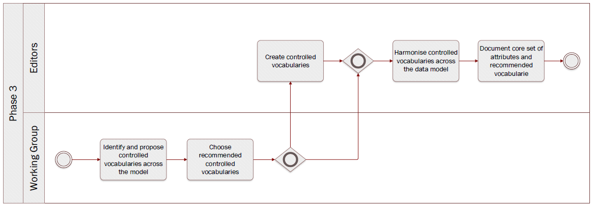

# Phase 3: Draft data model


**Quick links:**
- [`Step 6` Identify entities, attributes and descriptions used in national implementations](phase3.md#step-6-identify-entities-attributes-and-descriptions-used-in-national-implementations)
- [`Step 7` Identify and analyse models used or standardised elsewhere](phase3.md#step-7-identify-and-analyse-models-used-or-standardised-elsewhere)
- [`Step 8` Create UML class diagram](phase3.md#step-8-create-uml-class-diagram)
- [`Step 9` Description from ISA² Core Vocabularies](phase3.md#step-9-description-from-isa-core-vocabularies)
- [`Step 10` Description from respected dictionnary](phase3.md#step-10-description-from-respected-dictionnary)
- [`Step 11` Create tables for all entities](phase3.md#step-11-create-tables-for-all-entities)
- [`Step 12` Publish draft data model](phase3.md#step-12-publish-draft-data-model)

**Navigate to the different phases**\
[:arrow_left: Previous phase](phase2.md) **|**
[Next phase :arrow_right:](phase4.md)

## `Step 6` Identify entities, attributes and descriptions used in national implementations

**Key activities**
> * The [<b>Working Group</b>](../stakeholders#working-group) members identify and report features describing data models of evidence that are locally implemented.
> * The [<b>editors</b>](../stakeholders#editors) collect information from the Working Group members.

<details>
  <summary><b>Description</b></summary>
  
  Working Group members will share information they possess related to the common data model being built. The objective is to gather information in order to have a global overview of data models implemented and used across europe and leverage this insight to develop a common data model. This task is assigned to the Working Group members who will report back to the editors using the channels and collaborative tools defined. 

</details>

<details>
  <summary><b>Rules and Guidelines</b></summary>
  
Before sending any data, the Working Group members should bear in mind the following; 


* The data model has been validated and implemented by a competent authority; 
* The data model has been issued in a final version; and 
* The data model has been used in cross borders applications for exchange of information.

</details>

<details>
  <summary><b>Tool(s)</b></summary>
  <i>There are no specific tools for this step.</i>
</details>

<details>
  <summary><b>Example(s)</b></summary>
Example of information shared related to the data model (Issue #29); 


```
  The address information concerning administrative units could benefit from using NUTS URI to improve interoperability. In addition to ISA codes already used to describe addresses, NUTS URI would bring new properties to describe the location. 
  ```
</details>

## `Step 7` Identify and analyse models used or standardised elsewhere

**Key activities**
> The [<b>editors</b>](../stakeholders#editors) analyse european initiatives to standardize exchange of information

<details>
  <summary><b>Description</b></summary>
  
  The editors document any european initiatives that aim at standardizing data exchanges across member states. The output of this step will serve as a basis to draft the common data model. 

The scope of `step 6`and `step 7` are complementary: while Working Group members are gathering information on what is nationally implemented, the editor team will focus on existing european initiatives that are used and standardise the exchange of data. `step 6` will provide baseline information while `step 7` will provide information to supplement the first draft of the common data model. 

  
</details>

<details>
  <summary><b>Rules and Guidelines</b></summary>
</details>

<details>
  <summary><b>Tool(s)</b></summary>
  
  * [Study on Data Mapping for the crossborder application of the Once-Only technical system SDG](https://sdg.mindigital.gr/uploads/Deloitte_final_report.pdf)
  * [Linked Open Vocabularies](https://lov.linkeddata.es/dataset/lov)
  * [Euro Vocabularies](https://op.europa.eu/en/web/eu-vocabularies/home)
  * [Public documents forms | DG Justice](https://beta.e-justice.europa.eu/35981/EN/public_documents_forms)

</details>

<details>
  <summary><b>Example(s)</b></summary>

```
  TBD
  ```
</details>

## `Step 8` Create UML class diagram

**Key activities**
> The [<b>editors</b>](../stakeholders#editors) design an UML class diagram 

<details>
  <summary><b>Description</b></summary>
  
  The editor team will leverage from the information collected in `step 6` and `step 7` to develop an UML class diagram. The latter aims at visually describing how entities of the data model will interact with each other. The different entities, the relationship between entities, and their attributes as well as the expected type will be displayed.
  
  Attributes should be presented in the following manner _+ attributeName: expected type._ “Expected type” is further defined in `step 11`. 

Focusing only on entities, attributes and relationships will allow Working Group members to concentrate only on the semantic aspects of the model and come to terms on that. Further modelling elements shall be added in a textual way in step 11.  


</details>

<details>
  <summary><b>Rules and Guidelines</b></summary>
  
* Each element and their relationships should be identified in advance.
* Attributes of each class should be clearly identified
* Avoid as much as possible lines crossing each other
* Ensure orthogonality of relationships
* Parents elements are higher than the child elements so the arrows always point upwards
* Align elements either by one of their sides or by their centers
* Make elements the same size if possible

</details>

<details>
  <summary><b>Tool(s)</b></summary>
  Proprietary tools: 
  
  * [Entreprise Architect](https://www.sparxsystems.eu/enterprise-architect/)
  * [Miscrosoft Visio](https://www.microsoft.com/en-us/microsoft-365/visio)
</details>

<details>
  <summary><b>Example(s)</b></summary>

[Birth certificate evidence](https://github.com/SEMICeu/SDG-sandbox/blob/master/evidences/birth_certificate/data_model/birth_certificate_diagram_v0.10.pdf)

</details>

## `Step 9` Description from ISA² Core Vocabularies

**Key activities**
> The [<b>editors</b>](../stakeholders#editors) assess whether the ISA² Core Vocabularies can be reused


<details>
  <summary><b>Description</b></summary>
  
  The editors verify whether a ISA² Core Vocabulary can be reused. Reusability is a key principle when drafting data models. 
In case there is no ISA² Core Vocabulary reusable, or it is not coherent to the context of the data model, the editors will consider other possibilities as presented in `step 10`. 

</details>

<details>
  <summary><b>Rules and Guidelines</b></summary>
</details>

<details>
  <summary><b>Tool(s)</b></summary>
  
  
* [Core Person Vocabulary](https://joinup.ec.europa.eu/release/core-person-vocabulary/100)
* [Core Business Vocabulary](https://joinup.ec.europa.eu/release/core-business-vocabulary/100) 
* [Core Location Vocabulary](https://joinup.ec.europa.eu/release/core-location-vocabulary/100) 
* [Core Criterion and Core Evidence Vocabulary](https://joinup.ec.europa.eu/release/core-criterion-and-core-evidence-vocabulary-v100)
* [Core Public Organisation Vocabulary](https://joinup.ec.europa.eu/release/core-public-organisation-vocabulary-v100) 

</details>

<details>
  <summary><b>Example(s)</b></summary>

```
The Core Person Vocabulary describes a class/entity Person that has an attribute/property "gender" that expects a Code as data type, coming from four possible controlled vocs: ISO, Eurostat, HL7 or SDMX.
  ```
</details>

## `Step 10` Description from respected dictionnary

**Key activities**
> The [<b>editors</b>](../stakeholders#editors) fetch information elsewhere than the ISA² Core Vocabularies

<details>
  <summary><b>Description</b></summary>
  
  Should an entity or attribute not be (properly) defined in the ISA² Core Vocabularies, the editors fetch information elsewhere. Two outcomes are possible: 

1. The information can be found in other vocabularies
1. The information can not be found in other vocabularies 

In the event of information not being available, the editors propose new entities / attributes using respected and authoritative sources as inspiration. 

</details>

<details>
  <summary><b>Rules and Guidelines</b></summary>
</details>

<details>
  <summary><b>Tool(s)</b></summary>
  
* [Euro Vocabularies](https://op.europa.eu/en/web/eu-vocabularies/home)
* [Linked Open Vocabularies](https://lov.linkeddata.es/dataset/lov)
* [Oxford dictionary](https://www.oxfordlearnersdictionaries.com/us/)
* [Merriam-Webster](https://www.merriam-webster.com/)
  
</details>

<details>
  <summary><b>Example(s)</b></summary>

```
  TBD
  ```
</details>

## `Step 11` Create tables for all entities


**Key activities**
> The [<b>editors</b>](../stakeholders#editors) create tables for all entities.


<details>
  <summary><b>Description</b></summary>
  
  Relying on the input gathered in `step 9` and `step 10`, the editors draft tables for all the entities of the data model (as presented in `step 8`). Per entity, the table consists of the following elements; 

* Attribute(s) / relationship(s)
* Expected type 
* Definition
* Cardinality 

Tables are a way to provide further information and context to the data model unlike the UML class diagram which can be seen as a visual representation of the data model. Both form the data model referred to in the further steps. 

</details>

<details>
  <summary><b>Rules and Guidelines</b></summary>
  
* Entities names should start with an uppercase
* Attributes names should start with a lower case
* Entities as well as attributes and relationships should be accompanied by a definition. 

</details>

<details>
  <summary><b>Tool(s)</b></summary>
  <i>There are no specific tools for this step.</i>
</details>

<details>
  <summary><b>Example(s)</b></summary>

Here is are examples of tables created per entity, namely: 

* [Birth Certificate](birth_certificate_tables_v0.01.md#birth-certificate-1)
* [Birth](birth_certificate_tables_v0.01.md#birth)
* [Person](birth_certificate_tables_v0.01.md#person)
* [Public Organisation](birth_certificate_tables_v0.01.md#public-organisation)
* [Location](birth_certificate_tables_v0.01.md#location)
* [Address](birth_certificate_tables_v0.01.md#address)

</details>

## `Step 12` Publish draft data model 

**Key activities**
> The [<b>editors</b>](../stakeholders#editors) publish the output of `step 8` and `step 11`, i.e. the draft data model

<details>
  <summary><b>Description</b></summary>
  
  The editors will publish the draft version of the data model, if considered stable enough, based on the output of `step 8` (i.e. UML class diagram) and `step 11` (entity tables). The draft data model will be published on the collaborative tool selected. 
  
</details>

<details>
  <summary><b>Rules and Guidelines</b></summary>

Publication as a Working Draft does not imply endorsement by the Working Group members or its representatives. This is a draft model and may be updated, replaced or made obsolete by other model at any time. It is inappropriate to cite this model as other than work in progress. Comments on the model are invited. Further details on `Step 13` 

</details>

<details>
  <summary><b>Tool(s)</b></summary>
  <i>There are no specific tools for this step.</i>
</details>

<details>
  <summary><b>Example(s)</b></summary>

```
  TBD
  ```
</details>
