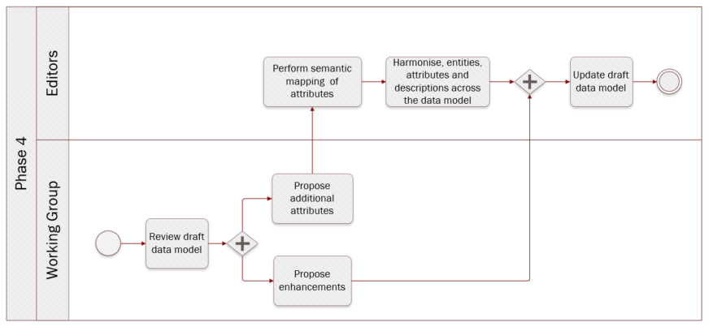

# Phase 4: Review data model and incorporate comments


**Quick links:**

- [`Step 15` Publish draft data model](../phase4.md#step-15-publish-draft-data-model)
- [`Step 16` Review draft data model](../phase4.md#step-16-review-draft-data-model)
- [`Step 17` Propose enhancements](../phase4.md#step-17-propose-enhancements)
- [`Step 18` Propose additional attributes](../phase4.md#step-18-propose-additional-attributes)
- [`Step 19` Perform semantic mapping of attributes](../phase4.md#step-19-performh-semantic-mapping-of-attributes)
- [`Step 20` Harmonise entities, attributes and descriptions across the data model](../phase4.md#step-20-Harmonise-entities,-attributes-and-descriptions-across-the-data-model)
- [`Step 21` Update draft data model](../phase4.md#step-21-Update-draft-data-model)


**Navigate to the different phases**\
[:arrow_left: Previous phase](phase3.md) **|**
[Next phase :arrow_right:](phase5.md)

## `Step 15` Publish draft data model
<i><b>Technical analysis</b> - identification of technical requirements and related solutions.</i>

**Key activities**
> * The [<b>Editors</b>](../stakeholders#editors) finalise the data model based on information collected in step 8, step 9, step 10, step 11, step 12, step 13 and step 14.
> * The [<b>Editors</b>](../stakeholders#editors) publish the output.

<details>
  <summary><b>Description</b></summary>
  
The draft data model expressed as an UML diagram with textual description (i.e. tables) of the entities, attributes, relationships, definitions, cardinalities, controlled vocabularies and usage notes is finalised. The Editors construct the final draft version of the data model based on the changes that have been agreed upon and derived from the previous seven steps. Additionally, the model is prepared for review.

Finally, it is important for Working Group members and the Editors to agree on an Open Licence to be used. Reusing content based on intrinsic licences may oblige editors to use a specific licence. Also, acknowledgement sections should be added specifying that data models developed heavily rely on the contributions of Working Group members, subsequently Member States. 
</details>

<details>
  <summary><b>Rules and Guidelines</b></summary>

* Publication as a Working Draft does not imply endorsement by the Working Group members or its representatives. This is a draft model and may be updated, replaced or made obsolete by another model at any time. It is inappropriate to cite this model as other than work in progress. Comments on the model are invited. Further details on Step 17.
* Choose an open license, e.g. CC0, [EUPL](https://joinup.ec.europa.eu/sites/default/files/custom-page/attachment/eupl_v1.2_en.pdf).
 - Publish the data model, its elements and related documentation via persistent (and ideally, dereferenceable) URIs.
 - Provide machine access to the data model.
 
</details>
<details>
  <summary><b>Tool(s)</b></summary>

  The collaborative tool, e.g. GitHub.
</details>

<details>
  <summary><b>Example(s)</b></summary>

Based on the steps described before, diagrams and [tables](https://github.com/SEMICeu/SDG-sandbox/commit/4d6f4f2140fccf97d328d4602d197bec50da3a9c), in their first version, were published. 
</details>

## `Step 16` Review draft data model
<i><b>Review</b> - formal assessment potentially leading to changes.</i>

**Key activities**
> * The [<b>Working Group members</b>](../stakeholders#working-group) directly review the proposed model and/or contact the [<b>domain experts</b>](../stakeholders#domain-experts) for reviewing it
> * The [<b>Editors</b>](../stakeholders#editors) moderate and classify the issues.

<details>
  <summary><b>Description</b></summary>
  
The Working Group members and the Editors agree on a tool to collaborate and capture the feedback. Using this tool, reviewers can create issues and the Editors follow up on them thanks to an issue tracker. 

Then, the Editors publish the draft using the collaborative tool. The published draft of the data model is reviewed by the Working Group members and domain experts when relevant. 

The Editors respond within an agreed timeframe to each issue made by the Working Group members, informing the reviewers that they have noticed and will process the issue. The Editors consolidate solutions to the issue and seek for additional contribution from the reviewers. This is done in collaboration with the moderator and rapporteur.

The issues can be in many different forms. For instance, an issue can deal with a modification to an existing entity or attribute, the addition or removal of an entity and/or attribute, etc. For further details about these types of issues, please check:

- [`Step 17` Propose enhancements](../phase4.md#step-17-propose-enhancements)
- [`Step 18` Propose additional attributes](../phase4.md#step-18-propose-additional-attributes)

Issues are categorised according to their type; (i) editorial (ii) minor or (iii) major. 

* <b>Editorial issue</b>: issue stemming from errors in the data model, which are not affecting the semantic agreement in any way. These issues might be addressed directly and do not lead to another review cycle.
* <b>Minor issue</b>: issue leading to direct changes in the deliverables. These issues might be addressed directly and do not lead to another review cycle.
* <b>Major issue</b>: issue qualified as show stopper and/or transversal issue. Either stakeholders decide the issue to be addressed directly, without leading to another review cycle, or once the issue addressed, the data model needs to undergo another review round. 

The moderator makes sure that the agreement process is transparent and acknowledged by all reviewers. 
</details>

<details>

  <summary><b>Rules and Guidelines</b></summary>

* Use case descriptions should be provided along with the data model.
* Model components should be translated.
* Editors organise issues as in a forum, by discussions, subjects and hierarchise the threads.
* Reviewers are encouraged to directly create issues on the collaborative tool.
* Reviewers are encouraged to propose a solution in case they raise an issue.
* Reviewers are encouraged to use labelling and tagging for increasing searchability and responsiveness of contributors.
* Reviewers should consider how to present and discuss issues (e.g. technical versus business aspects).
* Reviewers are encouraged to provide context to their issues (e.g. data model used).
* Reviewers are encouraged to structure their issues and especially their denomination to increase comprehension. For instance:

```diff
Name of the data model or sub-part (e.g. relevant entity) and a short statement of the issue

+ VehicleRegistrationCertificate evidence should contain registration status
```
* Additional commenting guidelines are described in the [Wiki](https://ec.europa.eu/cefdigital/wiki/x/NQHGDw). These guidelines are specific for the SDG OOP but generic across the Work Packages (and therefore not limited to this methodology).
</details>

<details>
  <summary><b>Tool(s)</b></summary>

  The collaborative tool, e.g. Confluence, GitHub.
</details>

<details>
  <summary><b>Example(s)</b></summary>
The following example describes the review of a draft data model followed by the creation of an issue and its processing by the Editors and the Working Group members. The process is the following:

1. The [<b>Editors</b>](../stakeholders#editors) publish on GitHub the diagram and tables describing [the Vehicle registration certificate](https://github.com/SEMICeu/SDG-sandbox/tree/master/evidences/vehicle_registration_certificate/data_model).
2. While reviewing the model, the [<b>domain experts</b>](../stakeholders#domain-experts) will try to answer the following questions: 
  * Can you process the evidence in your country if only the mandatory attributes are provided? If not, what other optional or missing attributes do you need?
  * Are the elements and their relationships correctly used and labelled?
  * Do you agree with the definition of the elements?
  * Are all elements necessary for this evidence described in the model?
  * Are there conflicts between the elements of the model and the elements used in your country?
  * Is the element mandatory or optional in your country (cardinality)?
  * Do you have specific codes or expected types (e.g. format of date, address etc.) for attributes?
3. The reviewers document their issues on GitHub. [For instance, concerning the Vehicle registration certificate, the following issue was created #45](https://github.com/SEMICeu/SDG-sandbox/tree/master/evidences/vehicle_registration_certificate/data_model).
```
  You may notice that the issue describes in practice several comments related to the vehicle registration certificate as well as an image of the data model used within the country. 
  ```
 
To simplify the contribution of other reviewers to this issue, the [<b>Editors</b>](../stakeholders#editors) will analyse the proposition, categorise it with labels, verify whether the issue should be restructured and describe the pros and cons of the issue documented.
 ```
  In our example, each bullet point from the general comment should represent a separate issue. 
  However, the editors should avoid as much as possible to complexify the structure of GitHub issues by creating complex hierarchies between the issues.
  For instance, the visual data model proposed by the issue owner does not need to be separated from the initial issue #45 since it represents a direct source of information which may be relevant for more than one issue. 
```
4. The [<b>Editors</b>](../stakeholders#editors) or the [<b>Moderators</b>](../stakeholders#moderatos) answer, usually within one working week, to the initial issue created by acknowledging the issue or directly giving an initial answer.
5. The [<b>Editors</b>](../stakeholders#editors) propose resolutions or ask more details concerning the issue(s) raised to trigger discussion and comments from other Working Group members.
6. The discussion continues as reviewers comment on the issue.
7. When no agreement has been reached, the [<b>Editors</b>](../stakeholders#editors) prepare the discussions and alternatives to be tackled during a webinar to be organised following the review period.

</details>

## `Step 17` Propose enhancements
<i><b>Review</b> - formal assessment potentially leading to changes.</i>

**Key activities**
> * The [<b>Working Group members</b>](../stakeholders#working-group) propose enhancements after reviewing the data model, if needed.  
> * The [<b>Editors</b>](../stakeholders#editors) consolidate the propositions and present them with resolutions to the Working Group members. If needed, the Editors seek for additional contributions from the reviewers in collaboration with the moderator and rapporteur.

<details>
  <summary><b>Description</b></summary>
  
Working Group members create semantic issues which deal with enhancements to the draft data model published. Enhancements can take the form of requests regarding the proposed draft data model. It can be changes to the definitions, relationships, data types, cardinalities, etc. 

In this context, it must be understood that enhancement also means restrictions, as one of the key principles of developing data models is data minimisation. 

As outlined in Step 16. Review draft data model, the Editors invite opinions and feedback to the issues and moderate the ensuing discussion.

After consideration of the proposition, the Editors assess the type of issue, whether it is minor or major, and record the resolution. After that, a response is sent to the reviewers. To a semantic issue, the response usually includes a summary of the context of the proposition, the resolution agreed by the Working Group members and the justification for the resolution, particularly in case the proposition is rejected.

</details>

<details>
  <summary><b>Rules and Guidelines</b></summary>

The Working Group members must resolve each proposition in one of three ways:
> * Accepted: This usually means that changes will be made that will be reflected in the next draft data model.
> * Rejected: No changes will be made to the draft data model.
> * Partially accepted: Part of the change is accepted, but other parts are rejected.
As indicated in the previous step, resolution will either lead to phase 5 or phase 4. 
</details>

<details>
  <summary><b>Tool(s)</b></summary>

There are no specific tools for this step. The GitHub issue feature can be used (or pull request feature for the more advanced users) to propose enhancements.
</details>

<details>

  <summary><b>Example(s)</b></summary>

As described in [issue#125](https://github.com/SEMICeu/SDG-sandbox/issues/125), a proposition was made to enhance an attribute as it was too narrowed down and did not encompass all the possibility for that attribute.

</details>

## `Step 18` Propose additional attributes
<i><b>Review</b> - formal assessment potentially leading to changes.</i>

**Key activities**
> * The [<b>Working Group members</b>](../stakeholders#working-group) propose additional attributes after reviewing the data model, if need be. 
> * The [<b>Editors</b>](../stakeholders#editors) consolidate the propositions and present them with resolutions to the Working Group members. If needed, the editors seek for additional contribution from the reviewers in collaboration with the moderator and rapporteur.. 

<details>
  <summary><b>Description</b></summary>
  
Working Group members create semantic issues which deal with attributes (and entities) that could or should be included in the draft data model published. It might be that in certain cases Working Group members request the deletion of an attribute, a controlled vocabulary, and/or entity. 

As outlined in Step 16. Review draft data model, the Editors invite opinions and feedback to the issue and moderate the ensuing discussion.

After consideration of the proposition, the Editors assess the type of issue, whether it is minor or major, and record the resolution. After that, a response is sent to the reviewers. The response usually includes the resolution agreed by the Working Group members and the justification for the resolution, particularly in case the proposed attribute(s) is (are) rejected
</details>

<details>
  <summary><b>Rules and Guidelines</b></summary>
  
  The Working Group members must resolve each proposition in one of three ways:

* Accepted: This usually means that changes will be made that will be reflected in the next draft data model.
* Rejected: No changes will be made to the draft data model.
* Partially accepted: Part of the change is accepted, but other parts are rejected.

By default, attributes and entities added to the data model are optional. 
</details>

<details>
  <summary><b>Tool(s)</b></summary>

There are no specific tools for this step. Similar to the previous step, we propose to use the GitHub issue feature (or pull request feature for the more advanced users) to propose additional attributes/entities.
</details>

<details>
  <summary><b>Example(s)</b></summary>

For instance, [issue #26](https://github.com/SEMICeu/SDG-sandbox/issues/26) suggested adding the CO2 emission per KM as well as the environmental class attributes to the vehicle class.
In [issue#73](https://github.com/SEMICeu/SDG-sandbox/issues/73) additional dates were added to the model. 

</details>

## `Step 19` Perform semantic mapping of attributes
<i><b>Technical analysis</b> - identification of technical requirements and related solutions.</i>

**Key activities**

> * Upon receiving additional attributes from the the [<b>Working Group members</b>](../stakeholders#working-group), the [<b>Editors</b>](../stakeholders#editors) perform a semantic clustering of attributes. Afterward, the Editors will map the ‘semantic clusters’ to existing attributes, if any. Should there not be an attribute to map a ‘semantic cluster’ to, the Editors will propose a new attribute (or entity). 
> * The [<b>Working Group members</b>](../stakeholders#working-group) discuss the ‘semantic clusters’ - and potentially the new attribute(s) - and work towards consensus.

<details>
  <summary><b>Description</b></summary>

Wherever attributes do not convey exactly the same information, ‘semantic clusters’ of similar attributes should be constructed to find a common, higher-level, and more general attribute to which the more specific attributes can be mapped.

</details>

<details>
  <summary><b>Rules and Guidelines</b></summary>
 
The relationships among different attributes (or entities) can be given a value according to the [SKOS (Simple Knowledge Organization System_Mapping system](https://www.w3.org/TR/skos-reference/#mapping).
The different values of which are
* exact match
* close match
* related match
* broader match
* narrower match
* (no match, i.e. absence of match)
 </details>

<details>
  <summary><b>Tool(s)</b></summary>
This step can be performed using a spreadsheet tool, such as Microsoft Excel, in which related attributes are juxtapositioned in two columns and given a semantic mapping value in a third column..
</details>

<details>
  <summary><b>Example(s)</b></summary>

> * speed hasCloseMatch velocity 
> * For instance, [#issue 143](https://github.com/SEMICeu/SDG-sandbox/issues/143) reported that in the [sex/gender code list from the Publication Office](https://op.europa.eu/en/web/eu-vocabularies/at-concept-scheme/-/resource/authority/human-sex/?target=Browse&uri=http://publications.europa.eu/resource/authority/human-sex), the property “not applicable” related to the legal recognition of non-binary gender. 

</details>
 

## `Step 20` Harmonise entitites, attributes and descriptions accross the data model
<i><b>Technical analysis</b> - identification of technical requirements and related solutions.</i>

**Key activities**

> * the [<b>Editors</b>](../stakeholders#editors) harmonise the entities, attributes and descriptions across the data model. 

<details>
  <summary><b>Description</b></summary>

The Editors consider all the entities, attributes and descriptions across the (all SDG) data model and check their consistency. The Editors may propose changes to the attributes, for example to harmonise the names and definitions across entities or solve inconsistencies.

</details>

<details>
  <summary><b>Rules and Guidelines</b></summary>
 
In order to guarantee semantic interoperability amongst different common data models – that might be developed at the same time –, the same modelling patterns, especially for concepts independent from a specific domain, can be applied across data models (e.g. location, person, organisation) unless specific characteristics for them are required.

 </details>

<details>
  <summary><b>Example(s)</b></summary>

Following a discussion on the SDG sandbox, the editors proposed to align the Location entity for all tertiary education related evidences (see [issue #133](https://github.com/SEMICeu/SDG-sandbox/issues/133#issuecomment-709353259)).
 
</details>


## `Step 21` Update draft data model
<i><b>Technical analysis</b> - identification of technical requirements and related solutions.</i>

**Key activities**

> the [<b>Editors</b>](../stakeholders#editors) create an updated coherent draft common data model based on information collected in the previous steps.

<details>
  
  <summary><b>Description</b></summary>

The draft data model expressed as an UML diagram with textual description (i.e. tables) of the entities, attributes, relationships, definitions, cardinalities and controlled vocabularies, i.e. codelists, is finalised. The Editors construct the new and final version of the data model based on the changes that have been agreed upon and derived from the previous four steps.

</details>

<details>
  <summary><b>Rules and Guidelines</b></summary>
 
Every element, e.g. attributes, needs to have a persistent identifier alongside labels that could be in different languages.
Publication as a last call Working Draft does not imply endorsement by the Working Group members or its representatives. This is a draft model and may be updated, replaced or made obsolete by another model at any time. Endorsement of the model will be sought in the `step 22`.

 </details>