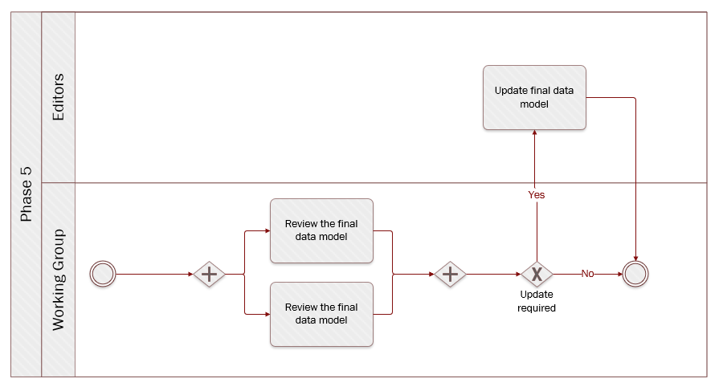

# Phase 5: Finalise data model

**Quick links:**
- [`Step 22`  Test the final data model with instance data](#step-22-Test-the-final-data-model-with-instance-data)
- [`Step 23`  Review the final data model](#step-23-Review-the-final-data-model)
- [`Step 24`  Update the final data model](#step-24-Update-the-final-model)

**Navigate to the different phases**\
[:arrow_left: Previous phase](phase4.md) **|**
[Next phase :arrow_right:](phase6.md)

## `Step 22`  Test the final data model with instance data
<i><b>Review</b> - formal assessment potentially leading to changes.</i>

**Key activities**
> * A selected number of [<b>Working Group members</b>](../stakeholders#working-group) and domain experts test the model against instance data.
> * The [<b>Editors</b>](../stakeholders#editors) assist the Working Group members in the testing by collecting and categorising the feedback.

  
<b>Description</b>

So far, the process of defining the elements of the data model was a theoretical exercise. The objective of this step is to test the final model against instance data, i.e. actual data, in order to discover potential flaws or blind spots in the model.  In this step, working group members have to provide (dummy) instance data and report on the challenges they face when:

* mapping this instance data to the model (perspective of the data provider). Working group members must answer the question: *“Can we provide this information?”.*
* processing instance data that respects the data model (perspective of the data consumer). Working group members must now answer the question: *“Can we process this information?”*, where the information represents the minimum data required by the model and, in this case, considering that the data was hypothetically received from another party. 

Mapping instance data is, in the jargon, looking from the data provider perspective. For instance, a person needs evidence of a diploma from studying in a Member State (A) for a procedure in another Member State (B). The mapping takes the perspective of Member State (A). From the other perspective, processing the instance data would take the role of the data consumer. In the example above, Member State (B) is the data consumer. 

A likely process for this step could be as follow:

1.	**Initiate** – All working group members have the possibility to volunteer for the testing of the data model with instance data. In the beginning of this exercise, editors will organise a meeting with the volunteers to walk them through the process and outline the expectations.
2.	**Map** – Volunteers will put on the hat of the data provider and create instance data for the data model, with as many attributes as available in their national system, and map them to the attributes in the template provided. 
3.	**Process** – Volunteers will put on the hat of the data consumer and receive minimal evidence  (mandatory fields only) data from another MS, i.e. another volunteer - as collected in the preceding step. Volunteers will then process the instance data received.
4.	**Report** – Volunteers will report on (semantic) challenges arising from both the mapping and processing of instance data. This step should reveal potential flaws in the model thanks to a life-like situation of processing an evidence.
5.	**Improve** – After the testing comes the reporting. Volunteers will therefore share their findings with the broad audience and discuss how to improve the models (e.g. by adding usage notes).

The feedback received during this step needs to be documented, categorized and analysed.

  
<b>Rules and Guidelines</b>

  
Questions to bear in mind when testing the model against instance data: 

* How relevant do you think the data in the attribute is for cross-border exchange?
* For the mandatory attributes: how can you process them, and are there any specific requirements for the format of the data?
* For the optional attributes: what are the challenges for processing of the data if the attribute is missing?

  
<b>Tools</b>

For this exercise, a spreadsheet can come in handy. 

| Attribute          | Expected type         | Definition                                                                                                                                                                        | Cardinality | Code list | Instance data | Mapping relation | Mapping Comment | Processing comment |
|--------------------|-----------------------|-----------------------------------------------------------------------------------------------------------------------------------------------------------------------------------|:-----------:|-----------|:-------------:|:----------------:|:---------------:|:------------------:|
| Identifier         | Identifier            | An unambiguous reference to the Tertiary Education Evidence.                                                                                                                      |    [1..1]   | N/A       |               |                  |                 |                    |
| issuing date       | Date                  | The date on which the Tertiary Education Evidence was issued.                                                                                                                     |    [1..1]   | N/A       |               |                  |                 |                    |
| language           | Code                  | The language in which the Tertiary Education Evidence is issued.                                                                                                                  |    [1..*]   | Language  |               |                  |                 |                    |
| qualification name | Text                  | Full name of the qualification, at least in the original language(s) as it is styled in the original qualification, e.g. Master of Science, Kandidat nauk, Maîtrise, Diplom, etc. |    [1..*]   | N/A       |               |                  |                 |                    |
| issuing place      | Location              | The Location where the Tertiary Education Evidence was issued.                                                                                                                    |    [1..1]   | N/A       |               |                  |                 |                    |
| belongs to         | Student               | The Student that is the holder of the Tertiary Education Evidence.                                                                                                                |    [1..1]   | N/A       |               |                  |                 |                    |
| obtained at        | Education Institution | The Education Institution that educated the Student.                                                                                                                              |    [0..*]   | N/A       |               |                  |                 |                    |
| issuing authority  | Organisation          | The Organisation that issued the Tertiary Education Evidence.                                                                                                                     |    [1..*]   | N/A       |               |                  |                 |                    |

Several columns to describe the model will be needed: 

* Attribute
* Expected type
* Definition 
* Cardinality
* Code list

Along with these elements, some input fields need to be provided: 

* Instance data - Actual data to be provided. For instance, the given name for Johann Sebastian Bach is “Johann Sebastian”
* Mapping relation - e.g. exact match, no match, near match, etc. [For further information on the definitions of  these mappings](https://www.w3.org/TR/skos-reference/#mapping)
* Mapping comment - Comments in case theres is a remark, suggestion, issue with the mapping, i.e. data provider perspective
* Processing comment - Comments in case there is a remark, suggestion, issue with the processing, i.e. data consumer perspective

## `Step 23`  Review the final data model 
<i><b>Review</b> - formal assessment potentially leading to changes.</i>

**Key activities**
> * The [<b>Working Group members</b>](../stakeholders#working-group) and the [<b>domain experts</b>](../stakeholders#domain-experts) review the final data model.
> * The [<b>Editors</b>](../stakeholders#editors) assist the Working Group members, collect and categorise the feedback. 

  
<b>Description</b>

  
Working Group members discuss and validate the data model with the business, domain experts and share their questions and / or remarks, if any, with the editors via the adequate channel.

In parallel, the Editors collect and, again, categorise the feedback. For instance:

* Editorial issue
* Minor issue
* Major issue 

This step is also important to set the final agreement on cardinalities. To help with that, the Editors have the possibility to propose editable tables. The sole purpose of the tables is for the Working Group members to indicate whether they are in capacity to provide the attributeslisted in the data model. But also whether a specific attribute is needed to process the evidence.

Ideally, the tables should be composed of the following columns:

* Entity
* Attribute
* Description
* Cardinality
* Country abbreviation 
 - multiple columns allowing Working Group members to specify whether an Attribute can be provided (Y) or not (N))
 - multiple columns allowing Working Group members to specify whether an Attribute is needed (Y) or not (N))

By no means the tables will replace the collaborative tool selected. The latter will still be home to the data model and a place to discuss the latter. The tables are a way to collect input on whether an attribute can be provided or not in a structured manner. In case further information is necessary to provide an answer, whether an attribute can be provided or not, the Working Group members have to be redirected to the collaborative tool selected.

Ultimately, the Working Group members have to come to a semantic agreement with regards to the data model reviewed. Unless there are major semantic changes, this step should be considered as a formal approval from the Working Group members for the data model.
  

  
<b>Rules and Guidelines</b>

Aspects to bear in mind while reviewing:
  
* Data elements and entity names
* Model appearance
* Rules of normalization
* Definitions
* Model flexibility

Questions to bear in mind while reviewing: 

* Do I agree with the proposed controlled vocabularies?
* Do I agree with the proposed changes to the data model? 
* Are the entities and attributes definitions clear enough? 
* Does the modelling approach make sense? 
* Do I agree with the proposed cardinalities (i.e. mandatory versus optional)
* With data minimisation in mind, should some of the entities and or attributes be stripped off?
* Will my country be able to provide all the mandatory information? 
* What information does my country need to process the evidence?  

  
<b>Example(s)</b>

  'Editable table' as described further above: 

| 				 |     Attribute                  | Description | Cardinality | AT | BE | BG | HR | CY | CZ | DK | EE | FI | FR | DE | EL | HU | IS | IE | IT | LV | LI | LT | LU | MT | NL | NO | PL | PT | RO | SK | SI | ES | SE |
|----------------|--------------------------------|-------------|-------------|----|----|----|----|----|----|----|----|----|----|----|----|----|----|----|----|----|----|----|----|----|----|----|----|----|----|----|----|----|----|
| Birth Evidence |                                |             |             |    |    |    |    |    |    |    |    |    |    |    |    |    |    |    |    |    |    |    |    |    |    |    |    |    |    |    |    |    |    |
|                | BirthEvidence.identifier       |    [Link]   | [1..1]      |    |    |    |    | Υ  |    |    | Y  |    |    |    |    |    |    |    |    |    |    |    |    |    |    | Y  |    | Y  |    |    |    | Y  | Y  |
|                | BirthEvidence.issuingDate      |    [Link]   | [1..1]      |    |    |    |    | Υ  |    |    | Y  |    |    |    |    |    |    |    |    |    |    |    |    |    |    | Y  |    | Y  |    |    |    | Y  | Y  |
|                | BirthEvidence.certifies        |    [Link]   | [1..1]      |    |    |    |    | Υ  |    |    | Y  |    |    |    |    |    |    |    |    |    |    |    |    |    |    | Y  |    | Y  |    |    |    | Y  | Y  |
|                | BirthEvidence.issuingAuthority |    [Link]   | [1..1]      |    |    |    |    | Υ  |    |    | Y  |    |    |    |    |    |    |    |    |    |    |    |    |    |    | Y  |    | Y  |    |    |    | Y  | Y  |

## `Step 24`  Update the final model
<i><b>Review</b> - formal assessment potentially leading to changes.</i>

**Key activities**
> * The [<b>Editors</b>](../stakeholders#editors) process any last feedback and finish the final model. 

  
<b>Description</b>

  
As the Working Group members have given feedback in the previous two steps, the Editors process these comments and make changes to the data modelas agreed with the Working Group members. From this point, the Editors can only make changes for which the Working Group members have reached a consensus. Since there is no review period anymore, all changes that are carried out during this step should have been discussed with the Working Group members.

  
<b>Rules and Guidelines</b>

* No change - not agreed upon by the Working Group - is made. 
* The change log is updated to reflect the final changes in order to achieve full transparency towards the Working Group.
* Every element, e.g. attributes, needs to have a persistent identifier alongside labels that could be in different languages.

