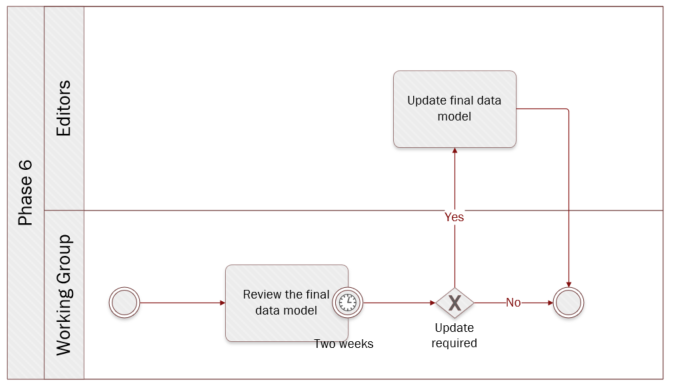

# Phase 6: Create distributions and publish documentation

**Quick links:**
- [`Step 25` Decide on the conformance requirements and develop a conformance statement](#step-25-Decide-on-the-conformance-requirements-and-develop-a-conformance-statement)
- [`Step 26` Create distributions](#step-26-Create-distributions)
- [`Step 27` Publish all documentation](#step-27-Publish-all-documentation)

**Navigate to the different phases**\
[:arrow_left: Previous phase](phase5.md) 

## `Step 25` Decide on the conformance requirements and develop a conformance statement 
<i><b>Technical analysis</b> - identification of technical requirements and related solutions.</i>

**Key activities**
> * The [<b>Editors</b>](../stakeholders#editors) write a conformance statement.
> * The [<b>Working Group members</b>](../stakeholders#working-group) agree on the conformance statement.

  
<b>Description</b>

  
A conformance statement declares a minimum set of requirements that an implementation must adhere to, in order to be considered conformant with the respective data model. The Working Group members must agree on these conformance requirements. The Editors then include a conformance statement in the OOTS data model for specific evidence types.

It is possible that the data model has natural divisions so that it might be appropriate to set different conformance levels. For example, a model used to describe vehicles may have a group of terms related specifically to motor vehicles that could be used in an implementation that has no needs to understand the terms that relate to bicycles. This will consequently lead to the establishment of different conformance levels.

  
<b>Rules and Guidelines</b>

  
  * Publish the conformance statement together with the OOTS data model for specific evidence types.

## `Step 26` Create distributions
<i><b>Technical analysis</b> - identification of technical requirements and related solutions.</i>

**Key activities**
>* The [<b>Editors</b>](../stakeholders#editors) create the required distributions for the data model.

  
<b>Description</b>

The data model can be expressed (or serialized) in various formats depending on the specific needs and context. Each distribution (format) will have its own uses and advantages, but also its own disadvantages and limitations.

Semantic data models can be expressed in different serialisation formats, such as TTL (RDF/turtle), RDF/XML, JSON-LD, SHACL, etc. Special care needs to be taken when using multiple formats, as conversion between different serialisation formats  can potentially introduce inconsistencies.  

Aside from these machine-readable formats, human-readable formats also need to be created. A visual representation of the entities, attributes and relationships of the data model is always recommended to provide a clear overview. This can for example be a UML-diagram, saved as a PNG-file. Next to this, human-readable documentation is also required with all the necessary information to construct the data models, i.e. the entities and attributes with their definitions, cardinalities, proposed codelists, etc. This can for example be distributed as an HTML-page and a PDF-document.

All these distributions can either be manually created, or automatically via one or multiple tools. If possible, preference should be given to the usage of an automated toolchain, reducing the risk of introducing inconsistencies during updates.

During this step, URIs are also created (or reused when possible) for the data model itself, its entities and their attributes. These identifiers need to be minted and maintained by a (European Commission) service.

  
<b>Rules and Guidelines</b>

  
* Create both machine-readable as well as human-readable distributions of the data model.
* Automate, if possible, the creation of the distributions as much as possible in order to avoid inconsistencies.
* Use [URIs](https://data.europa.eu/URI.html) under data.europa.eu which allows for flexibility for where the URIs resolve to.
* UML diagrams can be published in machine-readable formats, e.g. XMI.

  
<b>Tool(s)</b>

  
  * [VocBench3](https://ec.europa.eu/isa2/solutions/vocbench3_en)
  * Sparx Enterprise Architect
  * [Protégé](https://protege.stanford.edu/)

  
<b>Example(s)</b>

For instance, the Birth evidence was distributed in [XML](../data_model/birth_certificate_XML_example_v0.01.xml). 

## `Step 27` Publish all documentation
<i><b>Technical analysis</b> - identification of technical requirements and related solutions.</i>

**Key activities**
> * The [<b>Editors</b>](../stakeholders#editors) publish all documentation on the collaborative tool.

  
<b>Description</b>

  
  The Editors publish the final version of the data model, in both machine-readable and human-readable formats, on the selected collaborative tool. The Editors must publish the data model as open (meta)data and specify which license is applicable.

  
<b>Tool(s)</b>

  The collaborative tool, e.g. Confluence, Github. Ideally, a collaborative tool allowing public access is more appropriate for transparency reasons.

