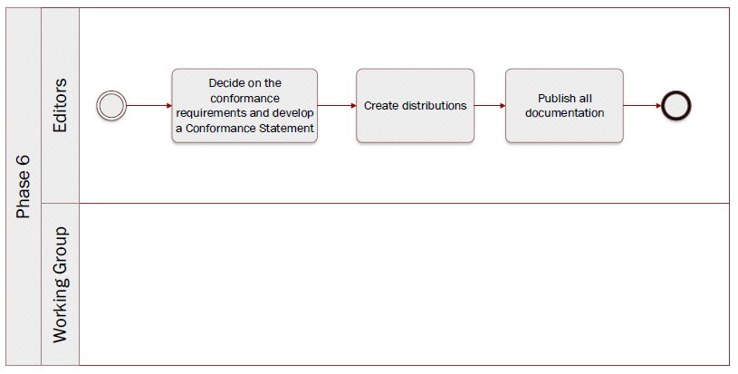

# Phase 6: Finalise data model


**Quick links:**
- [` Step 24`  Review the final data model](phase6.md#-step-24--review-the-final-data-model)
- [` Step 25`  Update the final data model](phase6.md#-step-25--update-the-final-model)

**Navigate to the different phases**\
[:arrow_left: Previous phase](phase5.md) **|**
[Next phase :arrow_right:](phase7.md)

## ` Step 24`  Review the final data model 

**Key activities**
> * The [<b>Working Group members</b>](../stakeholders#working-group) and the domain experts review the final data models
> * The [<b>editors</b>](../stakeholders#editors) assist the Working Group members, collect and categorize the feedback. 

<details>
  <summary><b>Description</b></summary>
  
  Working Group members discuss and validate the model with the business and functional experts and share their questions and / or remarks, if any, with the editors via the adequate channel. 

In parallel, the editors collect and categorize the feedback. For instance,
  
  * Editorial changes
  * Minor semantic changes
  * Major semantic changes - this entails a new version of the data model to be drafted and proposed for review. 
  
Ultimately, the Working Group members have to come to a [semantic agreement](https://github.com/cbahim/SDG-sandbox/tree/master/process_and_method/terminology) with regards to the data models reviewed.

To help reach that semantic agreement, the editors have the posibility to propose editable tables. The sole purpose of the tables is for Member States to indicate whether they are in capacity to provide the attributes listed in the data model. Ideally, the tables should be composed of the following columns;

* Entity
* Attribute
* Description
* Cardinality
* Country abbreviation (multipe columns allowing Member States to specify wehther an attribute can be provided (Y) or not (N)) 

By no means the tables will replace the collaborative tool selected. The latter will still be home to the models and a place to discuss the latter. The tables are a way to collect input on whether an attribute can be provided or not in a structured manner. In case further information is necessary to provide an answer whether or not an attribute can be provided, Member States have to be redirected to the collaborative tool selected.
  
</details>

<details>
  <summary><b>Rules and Guidelines</b></summary>

<b>Aspects</b> to bear in mind while reviewing:
  

* Data elements and entity names
* Model appearance
* Rules of normalization
* Definitions
* Model flexibility
* Keys

<b>Questions</b> to bear in mind while reviewing: 

* Do I agree with the proposed controlled vocabularies?
* Do I agree with the proposed changes to the data models? 
* Are the entities and attributes definitions clear enough? 
* Does the modelling approach make sense? 
* Do I agree with the proposed cardinalities (i.e. mandatory versus optional)
* With data minimisation in mind, should some of the entities and or attributes be stripped off?
* Will my country be able to provide all the mandatory information?  

</details>

<details>
  <summary><b>Tool(s)</b></summary>
  <i>There are no specific tools for this step.</i>
</details>

<details>
  <summary><b>Example(s)</b></summary>

```
  TBD
  ```
</details>

## ` Step 25`  Update the final model

**Key activities**
> * The [<b>editors</b>](../stakeholders#editors) process any last feedback and finish the final models. 

<details>
  <summary><b>Description</b></summary>
  
  In case the Working Group has given feedback in the previous step, the editors process these comments and make changes to the models as agreed by the Working Group.
  From this point, the editors can only make changes on which the Working Group has reached a consensus. Since there is no review period anymore, all changes that are carried out during this step should have been discussed with the Working Group. 
</details>

<details>
  <summary><b>Rules and Guidelines</b></summary>
  * No changes are made during this step that were not agreed upon by the Working Group.
  * The change log is updated to reflect the final changes in order to achieve full transparency towards the Working Group.
</details>

<details>
  <summary><b>Tool(s)</b></summary>
  <i>There are no specific tools for this step.</i>
</details>

<details>
  <summary><b>Example(s)</b></summary>

```
  TBD
  ```
</details>
