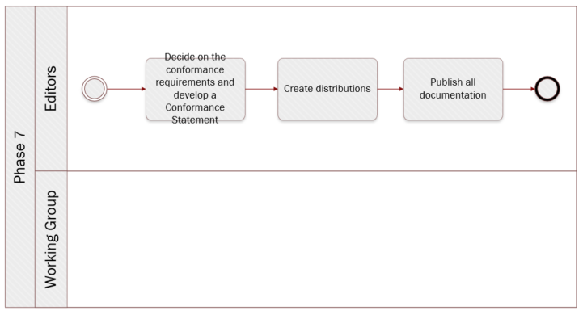

# Phase 7: Create distributions and publish documentation


**Quick links:**
- [Step 26. Decide on the conformance requirements and develop a conformance statement]()
- [Step 27. Create distributions]()
- [Step 28. Publish all documentation]()

**Navigate to the different phases**\
[:arrow_left: Previous phase](phase6.md) 

## `Step 26`. Decide on the conformance requirements and develop a conformance statement 

**Key activities**
> * The [<b>editors</b>](../stakeholders#editors) spell out a Conformance statement.
> * The [<b>Working Group members</b>](../stakeholders#working-group) agree on the Conformance Statement.


<details>
  <summary><b>Description</b></summary>
  
  The Working Group members must agree on the conformance requirements. The editor then includes a conformance statement into the common data model. That is, a statement that says what an implementation must do in order to be considered conformant with the model.

</details>

<details>
  <summary><b>Rules and Guidelines</b></summary>
  
  It is possible that the model has natural divisions so that it might be appropriate to set different conformance levels. For example, a model used to describe vehicles may have a group of terms related specifically to motor vehicles that could be used in an implementation that had no need to understand the terms that relate to bicycles and scooters. This will consequently lead to the establishment of different conformance levels. 

</details>

<details>
  <summary><b>Tool(s)</b></summary>
  <i>There are no specific tools for this step.</i>
</details>

<details>
  <summary><b>Example(s)</b></summary>

```
  TBD
  ```
</details>

## `Step 27`. Create distributions

**Key activities**
> 

<details>
  <summary><b>Description</b></summary>
</details>

<details>
  <summary><b>Rules and Guidelines</b></summary>
</details>

<details>
  <summary><b>Tool(s)</b></summary>
  <i>There are no specific tools for this step.</i>
</details>

<details>
  <summary><b>Example(s)</b></summary>

```
  TBD
  ```
</details>

## `Step 28`. Publish all documentation

**Key activities**
> * The [<b>editors</b>](../stakeholders#editors) publish all documentation? 

<details>
  <summary><b>Description</b></summary>
  
  The editors will publish the final version of the data model, in both machine-readable and human-readable format, on the collaborative tool selected.  

</details>

<details>
  <summary><b>Rules and Guidelines</b></summary>
</details>

<details>
  <summary><b>Tool(s)</b></summary>
  <i>There are no specific tools for this step.</i>
</details>

<details>
  <summary><b>Example(s)</b></summary>

```
  TBD
  ```
</details>
